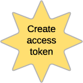
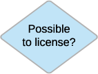
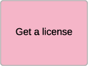

# Licensing assets and stuff*

(<super>*</super>Not a very catchy title, but there's more to this topic than how to get a license!)

_**Tl;dr version:** Use the Member/Profile API to check the status of an asset you want to purchase and your current quota, use Content/License to get a license, and download your asset. Also, use the LicenseHistory API to get a list of past purchases._

<!-- MarkdownTOC -->

- [Licensing workflow](#licensing-workflow)
    - [1. Get a token](#1-get-a-token)
    - [2. Get Stock asset ID](#2-get-stock-asset-id)
    - [3. Check if licensed](#3-check-if-licensed)
    - [4. Check if licensing is possible](#4-check-if-licensing-is-possible)
    - [5. License the asset](#5-license-the-asset)
    - [6. Download the file](#6-download-the-file)
- [Getting a license history](#getting-a-license-history)
- [Next steps](#next-steps)
- [Troubleshooting licensing requests](#troubleshooting-licensing-requests)
    - [Member/Profile issues](#memberprofile-issues)
    - [Other problems](#other-problems)
- [Q&A](#qa)

<!-- /MarkdownTOC -->


In the previous section, we covered how to hook up the Search API into your application. In this article, we'll cover the Adobe Stock **Content** and **Member** methods of the License API. These can get information about a user's licensing (entitlement) status, determine whether the user has an existing license for an asset, request a new license for an asset for that user, get a signed download URL for the asset, and get a history of past licensed assets. 


<a name="licensing-workflow"></a>
## Licensing workflow

Before you can purchase an asset using the API, there are a few tasks you will want to perform as part of your application flow, and this may trigger multiple decision points depending on your [use case](02-register-app.md). Like a children's board game, the process is not difficult as long as you understand the rules.



<a name="1-get-a-token"></a>
### 1. Get a token 

To do any activity involving licensing, you will first need to generate an access token. This is covered in detail in [Stock API Authentication](03-api-authentication.md) and in the individual OAuth and Service Account [workflow guides](07-workflow-guides.md).

<br><br>

<a name="2-get-stock-asset-id"></a>
### 2. Get Stock asset ID

The user starts their journey by getting a file's Stock ID (also called "media ID" and "content ID") typically from a search. This was covered in the previous section, and is a key part of any Stock workflow.

Some important items to note:

*   Stock IDs are not permanent/static. If you provide a checkout cart for your user, and the user saves the asset to license later, you should not assume that this asset is still available under that lD--you should verify. (See step #4, below.)
*   Templates and 3D content are more likely to change IDs, because they are updated more often.

For example, your user wants to license an image of a cute, fluffy kitten (and who wouldn't?) This is an extract of the JSON response from the search request, showing the ID we will need for our next set of operations.


```javascript
{
    /*...*/
    "id": 112670342,
    "title": "Kitten on white blanket",
    /*...*/
}
```


<br><br>

<a name="3-check-if-licensed"></a>
### 3. Check if licensed

It's best practice to check if the item is licensed already. There are two methods for this:


*   **As part of the search.**  When you are performing the search in step #2, a convenience method is to add the `is_licensed` field, which will be set to the license name if that user or organization has licensed this asset.

The main difference between this search request and the ones discussed in the previous section is that this one must be authenticated with an access token. Note the headers used in this request are the same as the ones used for search, with the addition of the `Authorization` header. You will use these same headers for all remaining licensing requests.


```bash
curl "https://stock.adobe.io/Rest/Media/1/Search/Files?locale=en_US&search_parameters%5Bmedia_id%5D=62305369&result_columns%5B%5D=id&result_columns%5B%5D=is_licensed" \
  -H "x-api-key: YourApiKeyHere" \
  -H "x-product: MySampleApp/1.0" \
  -H "authorization: Bearer AccessTokenHere"
```

Response:
```json
{
    "files": [
        {
            "id": 62305369,
            "is_licensed": "Standard"
        }
    ]
}
```


*   **Using Content/Info.** If you prefer an explicit method, you can call your first Licensing API request using Content/Info, which has the sole purpose of returning the current license state of an asset for that user (or for that org, if the user belongs to an enterprise).

Using this method, the API returns a `contents` object which contains the ID of the asset, and a sub-object `purchase_details` which lists the purchase state, license type and date.


```bash
curl "https://stock.adobe.io/Rest/Libraries/1/Content/Info?content_id=62305369&license=Standard" \
  -H "x-api-key: YourApiKeyHere" \
  -H "x-product: MySampleApp/1.0" \
  -H "authorization: Bearer AccessTokenHere"
```

Response:
```json
{
    "contents": {
        "62305369": {
            "content_id": "62305369",
            "size": "Comp",
            "purchase_details": {
                "state": "purchased",
                "license": "Standard",
                "date": "2017-11-01 22:57:48"
            }
        }
    }
}
```


In both cases, if the asset _is_ licensed, then there is nothing else to do but get the URL and download the asset. _Proceed to [step #6](#6-download-the-file)_.

<br><br>

<a name="4-check-if-licensing-is-possible"></a>
### 4. Check if licensing is possible

Assuming the asset is not already licensed, then you will check to see if it's possible to license this asset. This is to prevent a bad user experience and error if you tried to license the item and it cannot be licensed.

For this step, you will use the **Member/Profile** API. In addition to checking if the asset can be licensed, this will return the user's quota and also return a localized message about how many credits the license will cost. Getting the quota is useful as you can show that the user has "X" number of credits in your application's UI.

For the query string, you will need to provide the Stock ID with the `content_id` parameter. Ideally, also provide the license type if it is known (because some assets can have multiple license types); for images the normal default is "Standard." Refer to the [Licensing API reference](#) for more details. Also, if you want a localized message, also provide the language code.


```bash
curl "https://stock.adobe.io/Rest/Libraries/1/Member/Profile?content_id=112670342&license=Standard&locale=en_US" \
  -H "x-api-key: YourApiKeyHere" \
  -H "x-product: MySampleApp/1.0" \
  -H "authorization: Bearer AccessTokenHere"
```

Response:
```json
{
    "available_entitlement": {
        "quota": 1,
        "license_type_id": 42,
        "has_credit_model": false,
        "has_agency_model": true,
        "is_cce": true,
        "full_entitlement_quota": {
            "standard_credits_quota": 1
        }
    },
    "purchase_options": {
        "state": "possible",
        "requires_checkout": false,
        "message": "This will use your last standard credit."
    }
}
```


In the example, you can see that the `purchase_options.state` is "possible," which tells you that licensing can continue. If it is __not__ possible to license, go to [Troubleshooting](#troubleshooting-licensing-requests), below. Otherwise, continue to the next step.

<br><br>

<a name="5-license-the-asset"></a>
### 5. License the asset

Now you will perform the license purchase request using the **Content/License** API, which will deduct credits from the user or organizational account.

Use the same parameters and headers that you used in the Member/Profile request.


```bash
curl "https://stock.adobe.io/Rest/Libraries/1/Content/License?content_id=112670342&license=Standard" \
  -H "x-api-key: YourApiKeyHere" \
  -H "x-product: MySampleApp/1.0" \
  -H "authorization: Bearer AccessTokenHere"
```

Response:
```javascript
{
    "available_entitlement": {
        "quota": 0,
        "license_type_id": 42,
        "has_credit_model": false,
        "has_agency_model": true,
        "is_cce": true,
        "full_entitlement_quota": {
            "standard_credits_quota": 1
        }
    },
    "contents": {
        "112670342": {
            "content_id": "112670342",
            "size": "Comp",
            "purchase_details": {
                "state": "just_purchased",
                "license": "Standard",
                "date": "2017-11-06 02:54:18",
                "url": "https://stock.adobe.com/Rest/Libraries/Download/112670342/1",
                "content_type": "image/jpeg",
                "width": 4256,
                "height": 2832
            }, /*...*/
        }
    }
}
```


The response returns several fields, but the most important for your user is in the `contents.XXXX.purchase_details` object (where "XXXX" is the Stock ID). Here you will find the URL you will need to download the asset. In addition, if you want to update your UI, you can get the updated quota value from the response field `available_entitlement.quota`.

<br><br>

<a name="6-download-the-file"></a>
### 6. Download the file

Finally, you can download the full asset. Here you will call directly to the URL of the licensed asset that you obtained in the previous step:

```json
{
    "contents": {
        "112670342": {
            "purchase_details": {
                "url": "https://stock.adobe.com/Rest/Libraries/Download/112670342/1",
            }
        }
    }
}
```

Note that unlike the other requests, you do _not_ include the `Authorization` header, because that can cause the request to fail. Instead, you pass the access token using the __`token`__ parameter. The download also requires that your application has the ability to follow a redirect--make sure this option is enabled on your download client.


```http
https://stock.adobe.com/Rest/Libraries/Download/112670342/1?token=AccessTokenHere
```

Response:
```http
HTTP/1.1 200 OK
Accept-Ranges: bytes
Content-Disposition: attachment; filename="AdobeStock_112670342.jpeg";
Content-Length: 176164
Content-Type: image/jpeg
Date: Mon, 06 Nov 2017 03:18:50 GMT
```


This URL will trigger a download of the full asset. If you need a different size of the asset (for images only), you can use the __`size`__ parameter. See [Q&A](#qa), below.

Note that the token parameter does not include the word "Bearer" as it does when used as a header.

And you are done!

...assuming nothing went wrong. If it did, then continue reading. Also, check out common questions and answers about licensing assets. 


<a name="getting-a-license-history"></a>
## Getting a license history

Besides obtaining licenses for new assets (Content/License) or checking your credit quota (Member/Profile), another common use for the License API is to access your past history of purchases. This is done using the **Member/LicenseHistory** API. The format for this request is almost exactly the same as for other licensing methods, except that the result resembles a search request, even supporting pagination (if you have a lot of licensed assets).

In this example, license history is being requested for this account and the response is being limited to 1 file result (although 3 assets have been licensed), using the `search_parameters[limit]` query command.


```bash
curl "https://stock.adobe.io/Rest/Libraries/1/Member/LicenseHistory?search_parameters%5Blimit%5D=1" \
  -H "x-api-key: YourApiKeyHere" \
  -H "x-product: MySampleApp/1.0" \
  -H "authorization: Bearer AccessTokenHere"
```

Result:
```json
{
    "nb_results": 3,
    "files": [
        {
            "license": "Standard",
            "license_date": "11/6/17, 2:54 AM",
            "download_url": "https://stock.adobe.com/Download/DownloadFileDirectly/ikMRKBPqHDrtTifHkbbxGfKhIGVQPw6y",
            "id": 112670342,
            "title": "Kitten on white blanket",
            "creator_name": "byrdyak",
            "creator_id": 202614441,
            "content_url": "https://stock.adobe.com/Rest/stock-photo/kitten-on-white-blanket/112670342",
            "media_type_id": 1,
            "vector_type": null,
            "content_type": "image/jpeg",
            "height": 2832,
            "width": 4256,
            "details_url": "https://stock.adobe.com/112670342?as_channel=affiliate&as_source=api&as_content=b4e3ee08719247cc85e9ba92970b1028"
        }
    ]
}
```


Notice that one of the fields returned is the download URL, making this a convenience method if you want your users to be able to re-download an asset they have previously licensed. Downloading the asset again does not trigger a new license request. Even though the format is slightly different, you would still use this download URL with a `token=<access token>` parameter.

```http
https://stock.adobe.com/Download/DownloadFileDirectly/ikMRKBPqHDrtTifHkbbxGfKhIGVQPw6y?token=AccessTokenHere
```

<a name="next-steps"></a>
## Next steps

You have completed the Adobe Stock API getting started guide. 


*   If you want more detail on anything you have read thus far, explore the [API reference documentation](#).
*   If you are ready to get started in earnest, browse our [sample code and SDKs](08-sample-code-sdks.md).


<a name="troubleshooting-licensing-requests"></a>
## Troubleshooting licensing requests

In most cases, everything should happen as outlined above. But if it doesn't, you need to know how to diagnose the issue and correct it.


<a name="memberprofile-issues"></a>
### Member/Profile issues

In step #4 above, we used Member/Profile to check if licensing was possible. But what if it was not possible?

In that case, we would have seen a JSON response message like this:


```json
    "purchase_options": {
        "state": "not_possible",
    }
```


If this happens, you can build some checks into your application. 

<br><br>

#### Problem: Asset type can't be licensed

First, check the type of asset you are licensing and compare that to what you are allowed to license. One of the most common situations is that you are trying to license a Premium or Video asset, which you might not be allowed to license under a standard image subscription. For a better understanding of asset types and how to license them, see the [Adobe Stock plans](https://stock.adobe.com/plans#get-credits) page. Note that even if you plan only includes images, you may still be able to license the asset if Adobe has a payment instrument (such as a credit card) on file. In that case, the state will be "overage" instead of "not_possible."

You will see this message if the asset is Premium or Video, and your plan does not include this content:


```json
{
    "available_entitlement": null,
    "member": {
        "stock_id": 43289915
    },
    "purchase_options": {
        "state": "not_possible",
        "message": "You cannot license this type of asset with your standard credits quota. Please contact your administrator to upgrade your current plan."
    }
}
```


While the message above does not tell you what type of asset this is, you can get this from the search result you performed in step #2, above, if you request the content_type and premium_level_id response fields.

If the premium level is not 0 (standard), then it's possible your plan does not cover it.


```json
{
    "nb_results": 1,
    "files": [
        {
            "id": 124287454,
            "title": "Kitten Peeking Through Barn Doors; Steinbach, Manitoba, Canada",
            "content_type": "image/jpeg",
            "premium_level_id": 3
        }
    ]
}
```


Video assets could have a premium_level of 0, but simply because the content type is video (e.g., `video/quicktime`, `video/mp4`, etc.), realize that you must have credits to license it.


```json
{
    "nb_results": 1,
    "files": [
        {
            "id": 121222021,
            "title": "Christmas kitten meows",
            "content_type": "video/quicktime",
            "premium_level_id": 0
        }
    ]
}
```


<br><br>

#### Solution: Purchase universal credits or upgrade your plan

If you do not belong to an enterprise entitlement, the solution is easy: go to [Adobe Stock plans](https://stock.adobe.com/plans) and purchase a universal credit pack. You can still use your image credits for standard images, templates and 3D, and reserve your new credits for special assets.

If you _do_ belong to an enterprise organization, you will need to contact your Adobe sales team for options.

<br><br>

#### Problem: No credits or not enough credits

The next most common scenario is that you don't have enough credits in your account. Situations where this may occur:


*   _All credits have been used up._ This is indicated by a `available_entitlement.quota` property value of 0.
*   _The asset you want to license requires more credits than you have._ As mentioned above, Premium and Video assets cannot be licensed using standard image credits--they require universal credits, or an on-demand purchase separate from your subscription. Furthermore, the price per asset is greater than one credit. As seen on the [Adobe Stock plans](https://stock.adobe.com/plans) page, these assets could range from 2 credits up to 50 credits each.

In both cases, if `purchase_options.requires_checkout` is `true` but licensing is not possible, then you will need to take actions on your account to add more credits. This combination of values means that you cannot license at this time via the API, but may be able to if you correct the issue.


```json
{
    "available_entitlement": {
        "quota": 0,
        "full_entitlement_quota": {
            "standard_credits_quota": 0
        }
    },
    "purchase_options": {
        "state": "not_possible",
        "requires_checkout": true,
        "message": "You don't have enough standard credits to license this asset. Please contact your administrator to add more standard credits to your account."
    }
}
```


<br><br>

#### Solution (enterprise): Add quota to your PLC

If you belong to an enterprise organization and you need more credits than you have available, you can simply add additional quota in your product license configuration (PLC). This is done by your account administrator, as described in the [Service Account workflow guide](07-workflow-guides.md), or [documented here](https://helpx.adobe.com/enterprise/help/adobe-stock-enterprise.html#Updateaproductconfigurationsdownloadlimit). Enterprise customers can add more quota than they have available, and those extra credits will be charged back at a later date.

One reason enterprises may want to intentionally limit their PLC is if each department is given a separate quota. A quota limit allows the administrator to force the department to request more quota if it goes over its limit.

Note that admins can only add more credits for the type of assets they have agreed to license, per their contract. For example, if a contract only has standard image credits, the administrator cannot add universal credits for Premium or Video assets. In this case, the Adobe sales team must be contacted.


<br><br>

#### Solution (non-enterprise): Buy credits or save payment info

You need credits to purchase licenses, whether those are standard image credits or universal credits. If you do not belong to an enterprise org, you can get a subscription or credit pack from [Adobe Stock plans](https://stock.adobe.com/plans). Alternatively, if you keep a payment method on file (such as a credit card or PayPal account), it's possible that the API can automatically deduct the funds. In this case, the state in the Member/Profile response will be "overage."

Note that some assets (such as some Creative Cloud templates) are free, and do not require a subscription or credits as long as you are a non-enterprise user.

<br><br>

#### Solution: Look further or get help

In the unlikely case where you do have credits _and_ licensing is possible, then something else may be happening. Use the [Postman](https://www.getpostman.com/) or [curl](https://curl.haxx.se/) tools to verify that your application is not getting bad or stale data (for example, it is caching previous responses), and the Adobe Stock API is not returning a 400 error (see below). 

If none of those things are happening, then [contact Support](/content/udp/en/apis/creativecloud/stock-v2/contact-us.html).


<a name="other-problems"></a>
### Other problems 

In the previous cases, Member/Profile and the other APIs will return a valid 200 response. But in the cases below, you will get a 400 error. Here are a couple common reasons, but see more in the [Stock API reference](#) section.


#### Wrong license type

You can get this error if you try to license an asset with a mismatched license type. For example, Images, 3D and Templates allow a "Standard" license, but Videos have valid licenses of "Video_HD" and "Video_4K." If you do not specify one of those values for a video, you will get this error.


```json
{
    "error": "The license \"Standard\" does not match type of content #121222021",
    "code": "020",
    "case": "pkx2JXqL7ePdNCXAewS2R7U0PvF27KND"
}
```


#### Expired or invalid token

As a best practice, your user should have to sign in for each session, or if you are using an enterprise application, it should request a new token. Access tokens have a 24-hour expiration, so unless you use a refresh token or unless your user told the Adobe sign-in screen to "remember me," it is expected that the token will expire after a fixed amount of time.


```json
{
    "error_code": "401013",
    "message": "Oauth token is not valid"
}
```


<a name="qa"></a>
## Q&A


<a name="can-i-find-out-how-many-credits-are-remaining"></a>
#### Can I find out how many credits are remaining?

Yes, from the **Member/Profile** API. You can either call a specific ID and license type, or leave off those parameters.

Note that if you do include the content_id in your request and you have more than one type of credit (e.g., standard image credits and universal credits), the `available_entitlement.quota` value will reflect the credits available _for that type of asset_. For example, if you are querying about a video, then you will get back the number of credits available for Video and Premium content.


```bash
curl "https://stock.adobe.io/Rest/Libraries/1/Member/Profile?locale=en_US" \
  -H "x-api-key: YourApiKeyHere" \
  -H "x-product: MySampleApp/1.0" \
  -H "authorization: Bearer AccessTokenHere"
```

Response:
```json
{
    "available_entitlement": {
        "quota": 3,
        "license_type_id": 16,
        "has_credit_model": true,
        "has_agency_model": false,
        "is_cce": true,
        "full_entitlement_quota": {
            "credits_quota": 3
        }
    },
    "member": {
        "stock_id": 41003529
    },
    "purchase_options": {
        "state": "possible",
        "requires_checkout": false,
        "message": "This will use 1 of your 3 credits."
    }
}
```


<a name="how-can-i-tell-if-the-user-has-an-enterprise-entitlement"></a>
#### How can I tell if the user has an enterprise entitlement?

In general, if you are a _member_ of an Adobe Enterprise customer you will realize this, however, if you are a partner using an OAuth integration, you may not know in advance what kind of user is signing in. For example, you may want to identify and target enterprise users differently than regular users. 

This can also be done using the **Member/Profile** API. In the previous example, the property `available_entitlement.is_cce` will be __true__ if the user has an enterprise Stock entitlement.

```json
        "is_cce": true,
```

One thing to note is that Adobe Stock does not have enterprise "accounts" but rather enterprise "entitlements." The point is that a user may be signed in with a free Creative Cloud account, but still be assigned to an account which has enterprise Stock entitlements. That same user may also have a personal (non-enterprise) subscription to Creative Cloud applications. It is best to use the term "entitlement" rather than "account" when dealing with enterprises at Adobe.


<a name="is-it-possible-to-get-an-image-in-different-size"></a>
#### Is it possible to get an image in different size?

When you license an image, you license the full/original size of the asset. However, there are times when you need a smaller size, for example to include in a social media post or email. 

The Stock API has a command for this situation. Simply add a __`size=`__ parameter to the download URL, and Adobe Stock will return the _next larger_ size. The actual size returned depends on the original size of the asset; see the [Licensing API reference](#) for more details.

Example: You want a 350px image for your page.


```http
https://stock.adobe.io/Rest/Libraries/Download/112670342/1?size=350&token=AccessTokenHere
```


<a name="how-can-i-test-licensing-assets-if-i-do-not-have-an-adobe-stock-plan-or-contract"></a>
#### How can I test licensing assets if I do not have an Adobe Stock plan or contract?

If you are an independent developer or student, you can follow the [Affiliate workflow](07-workflow-guides.md) and sign up for an API key. If you want to also test licensing an asset, you can test it on a free asset like one of our great [Creative Cloud Stock templates](https://stock.adobe.com/templates) (not all templates are free, but many are).

However, if you are interested in partnering with Adobe Stock and have a legitimate reason for a demo account, [contact us](/content/udp/en/apis/creativecloud/stock-v2/contact-us.html).

