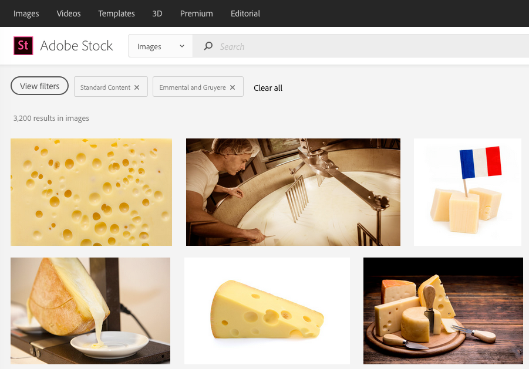

# CategoryTree API reference

<!-- MarkdownTOC -->

*   [Category Tree calls](#category-tree-calls)
    *   [Authentication](#authentication)
    *   [Request headers](#request-headers)
    *   [URL parameters](#url-parameters)
*   [Responses](#responses)
*   [Example requests and responses](#example-requests-and-responses)

<!-- /MarkdownTOC -->

The Category Tree API returns category information for selected category IDs. If you call the API without specifying a category, `CategoryTree` returns a list of all top-level Adobe Stock categories.

You can optionally request the results in languages other than English by using the `locale` parameter.

**Please note** that categories are metadata set manually by the Stock Contributor (the photographer or artist who uploaded the asset), not by Adobe Stock. Therefore, if the asset is not categorized correctly, it is due to *human error*. Also, the Stock Search API does not use machine-learning algorithms when searching by category--it can only rely on information provided by the Contributor. Finally, categories are not actively curated by Adobe Stock, so new categories are not added or removed on a regular basis.

On the other hand, keyword search *is* driven by both machine learning and by Contributor metadata. For that reason, **searching by keywords *instead of* categories is considered a best practice**, and is generally more reliable and accurate. Adobe Stock maintains this API mainly for backwards compatibility with existing applications.

## Category Tree calls

| Endpoint | Methods |
| ------------ | ------------- |
| https://stock.adobe.io/Rest/Media/1/Search/CategoryTree | GET |

### Authentication

An `Authorization` header is not required.

### Request headers

See [API authentication](../getting-started/03-api-authentication.md) and [Headers for Stock API calls](10-headers-for-api-calls.md) for details about header content.

*   Required headers: `x-Product`, `x-api-key`
*   Optional headers: `Authorization`, `X-Request-Id`

### URL parameters

Pass the following parameters with a GET request.

| Parameter   | Description                                                                                            |
|-------------|--------------------------------------------------------------------------------------------------------|
| locale      | Location language code. String. Default is <code>en_US</code>. See the full list of <a href="14-locale-codes.md">Locales</a>. String.                          |
| category_id | Optional. Unique identifier for an existing category; results are returned for this category. Integer. |

## Responses

CategoryTree's response is returned in a JSON array that can contain multiple category structures. Each category may have child categories beneath it that can be discovered with subsequent requests.

    [
        {
            "id": Integer,
            "link": String,
            "name": String
        },
        {
            "id": Integer,
            "link": String,
            "name": String
        }
    ]

| Name | Description                                                                                      |
|------|--------------------------------------------------------------------------------------------------|
| id   | Unique identifier for the category. Integer.                                                     |
| link | Category path. The format is:  `/Category/linkname/category_id`  See below for example usage. String. |
| name | Localized category name. See <a href="14-locale-codes.md">Locales</a>. String.                                                    |

## Example requests and responses

First, we obtain a list of all top-level categories by not including the `category_id` parameter.

    GET /Rest/Media/1/Search/CategoryTree HTTP/1.1
    Host: stock.adobe.io
    X-Product: MySampleApp/1.0
    x-api-key: MyApiKey

The response is multiple categories, including "Food" (id 289).

    [
        {
            "id": 261,
            "link": "/Category/states-of-mind/261?load_type=category",
            "name": "States of Mind"
        },
        {
            "id": 289,
            "link": "/Category/food/289?load_type=category",
            "name": "Food"
        },
        {
            "id": 444,
            "link": "/Category/graphic-resources/444?load_type=category",
            "name": "Graphic Resources"
        },
    ]

The category "Food" has multiple child subcategories which we cannot see here without further requests. Here is a subset of its category structure.

*   Food
    *   Accessories
    *   Bread
    *   Cheese and Dairy Products
        *   Camembert
        *   Cheddar
        *   Emmental and Gruyere
        *   Feta
    *   Cooking

To get the first child level of Food, we pass its `category_id` of 289.

    GET /Rest/Media/1/Search/CategoryTree?category_id=289 HTTP/1.1
    Host: stock.adobe.io
    X-Product: MySampleApp/1.0
    x-api-key: MyApiKey

We see it has child IDs of 300, 301, and 311.

    [
        {
            "id": 300,
            "link": "/Category/bread/300?load_type=category",
            "name": "Bread"
        },
        {
            "id": 301,
            "link": "/Category/cheese-and-dairy-products/301?load_type=category",
            "name": "Cheese and Dairy Products"
        },
        {
            "id": 311,
            "link": "/Category/cooking/311?load_type=category",
            "name": "Cooking"
        },
    ]

If we want to see the children of "Cheese and Dairy Products", we make another request for `category_id` 301.

    GET /Rest/Media/1/Search/CategoryTree?category_id=301 HTTP/1.1
    Host: stock.adobe.io
    X-Product: MySampleApp/1.0
    x-api-key: MyApiKey

And get back multiple types of cheeses.

    [
        {
            "id": 302,
            "link": "/Category/camembert/302?load_type=category",
            "name": "Camembert"
        },
        {
            "id": 303,
            "link": "/Category/cheddar/303?load_type=category",
            "name": "Cheddar"
        },
        {
            "id": 304,
            "link": "/Category/emmental-and-gruyere/304?load_type=category",
            "name": "Emmental and Gruyere"
        },
        {
            "id": 305,
            "link": "/Category/feta/305?load_type=category",
            "name": "Feta"
        },
    ]

We cannot go further than this, because there is a limit of 3 to each category.

From the data above, we can construct URLs to the Adobe Stock website using the `link` response fields.

*   Food: https://stock.adobe.com/Category/food/289?load_type=category
    *   Cheese and Dairy Products: https://stock.adobe.com/Category/cheese-and-dairy-products/301?load_type=category
        *   Cheddar: https://stock.adobe.com/Category/cheddar/303?load_type=category
        *   Emmental and Gruyere: https://stock.adobe.com/Category/emmental-and-gruyere/304?load_type=category

And on the Stock website, we can see the category filter applied:

