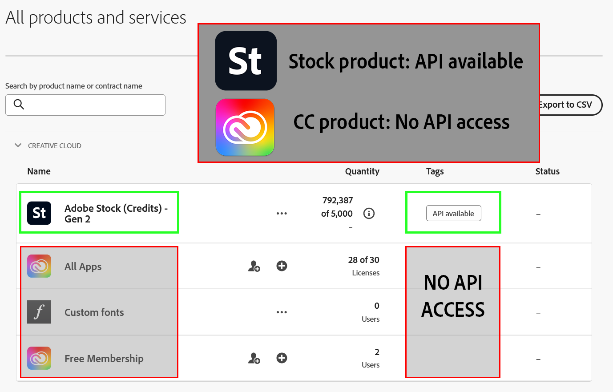
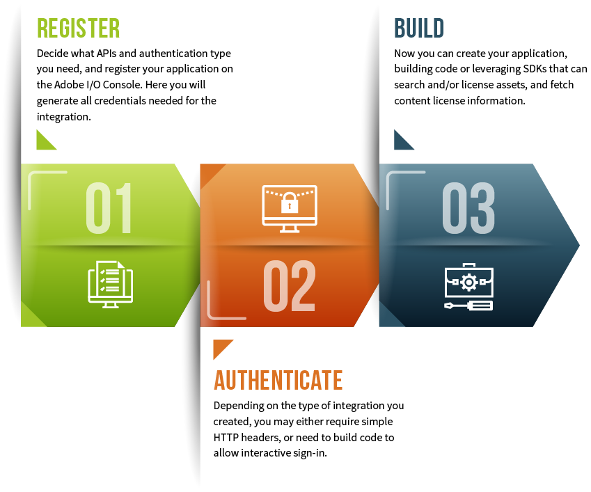

---
keywords:
  - Adobe Stock
  - Stock API
  - Stock Photos
  - Stock Video
  - Premium Images
  - Illustrations
  - Creative Cloud 
title: Stock APIs
description: Getting started with the Adobe Stock API. Build an API application to access millions of royalty-free stock images, photos, graphics, vectors, video footage, illustrations, templates, 3d assets, editorial assets and high-quality premium content.
---

<!-- 01-getting-started.md -->
<!-- omit in toc -->

# Getting started with the Adobe Stock API

<InlineAlert variant="warning" slots="header, text1, text2, text3, text4" />

Please read me!

Beginning in November, 2024, the Stock API will only be available to Stock for Enterprise customers. If you don't know if you have Stock for Enterprise, see [Do I have Stock for Enterprise?](#do-i-have-stock-for-enterprise) To create an integration, you must either be a System Administrator or a [member of the Developers group](https://helpx.adobe.com/enterprise/using/manage-developers.html) for the Stock product. *Hint: If you do not see an option to add Developers or API credentials, then you **do not** have Stock for Enterprise.* If you want to get a quote for Stock for Enterprise, please contact your Adobe account representative or [request a callback](https://www.adobe.com/creativecloud/business/enterprise.html#creativecloud-rfi). 

If you are a Stock for Enterprise customer, then you can create a [Server to Server integration](https://developer.adobe.com/developer-console/docs/guides/authentication/ServerToServerAuthentication/), which does not require a login. Go to [Overview](#overview) to begin.

If you do not have Stock for Enterprise or in the [Adobe Affiliate program](#adobe-affiliates), then you will not be able to create an integration at this time without being accepted into a program unless you have a compelling business reason or have an Adobe business sponsor. Adobe affiliates who are approved to join the Adobe campaign may be pre-approved.

**Please note that existing integrations with OAuth User authentication credentials will be in a "read-only" mode until you request approval. You will not be able to make changes to your existing integrations without approval.**

## Approval process

If you are not a Stock for Enterprise customer, the easiest approval method is to join the [Adobe Affiliate](#adobe-affiliates) program.

1.  All users: Apply [here to the Adobe Prerelease program for the Stock API](https://www.adobeprerelease.com/beta/79B872A3-CA32-4674-F795-AFABA6AE25DC).

2.  If you are not an Adobe Affiliate, [fill out this survey](https://survey.adobe.com/jfe/form/SV_9mMgSGa8OfhDTSe) to give us details about your application and intended use of the Stock API. Some questions are optional, but the more details you give, the better your chances for being accepted.

Approval is not required for Stock for Enteprise customers unless you need to create an [OAuth User authentication](https://developer.adobe.com/developer-console/docs/guides/authentication/UserAuthentication/) credential. Enterprise customers can create Server-to-server authentication credentials without an issue. For User authentication, you must apply to the Prerelease program.

You may email [the Stock API team](mailto:stockapis@adobe.com) with questions.

<!--
To request approval: Go to https://www.adobeprerelease.com and join the "Adobe Stock API" program. As noted, if you have been approved to join the Adobe Affiliate program, then you should be approved to use the Stock API. 
-->

## Do I have Stock for Enterprise?

1. First, do you have access to the [Adobe Admin Console](https://adminconsole.adobe.com/)?
2. Second, when you click on Products, do you see an Adobe Stock product or a Creative Cloud (CC) product? In the screenshot below, this customer has an Adobe Stock Credits product, as well as a CC All Apps product. They can use the Stock API, but only with their Stock credits product. They cannot create an integration for CC All Apps because it is not a Stock product.

For more information on why Creative Cloud does not have API access, see the FAQ [May I use my Creative Cloud Professional or Professional Plus plan with the Stock API?](https://developer.adobe.com/stock/docs/faq/stock-api-business-faq/#may-i-use-my-creative-cloud-professional-or-professional-plus-plan-with-the-stock-api).

## Adobe Affiliates

Join the Adobe Affiliate Program and earn attractive commissions. Promote Adobe Creative Cloud, Adobe Stock and Adobe Document Cloud on your website, blog or social media channel. It's free, it's easy, and it pays.

While most Adobe Affiliates display banner advertising on their websites, affiliate partners can choose to integrate with the Stock Search API to create a custom search experience for their users. 

  *  To join the Adobe Affiliate Program, go here: [https://www.adobe.com/affiliates.html](https://www.adobe.com/affiliates.html).
  *  For an in-depth use case, see [Get Paid to Search Adobe Stock!](https://medium.com/adobetech/get-paid-to-search-adobe-stock-e2ba9a7c0312)

See the [Affiliates FAQ](faq/stock-api-business-faq.md#affiliates-faq) for more information.

Note that you will still need to join the [Stock API Prerelease program](https://www.adobeprerelease.com) as well as join the Adobe Affiliate program.

<InlineAlert slots="text" />
Continue here once you have access to the API!

## Overview

The Adobe Stock API provides programmatic access to [Adobe Stock](https://stock.adobe.com/) content. You can integrate this API into your organization's applications and processes. You can use the API in scripts or programs to search for and retrieve Adobe Stock assets such as photos, videos, and vector files, and to license assets for your users.

You interact with the Adobe Stock API via HTTP requests instead of a user interface. You can create applications that perform these actions:

*   **Search for and retrieve Adobe Stock assets.** Your applications can search by keywords, models, contributor, series, and categories, and can also request assets that are similar to other assets or images. You can sort, filter, and page through any results from your searches. Search results contain URLs for thumbnails of the found assets, which you can use to display the thumbnails to your users. Results also can contain metadata about the assets, including information that your applications can use to retrieve the original asset.

*   **License assets that your search retrieves.** If you have an Authentication token, you can use the API to determine your user's purchasing status, obtain a license for the user for a specific asset, and download the original asset.

*   **Get a license history of past purchases.** In addition to allowing users to license and download content, your application can retrieve the licensing history for your users or organization, allowing download of previously purchased assets.

### API workflow

At its simplest, all Stock API integrations include these steps:

1.  Register your application on Adobe I/O.
1.  Determine the authentication method from your use case and build appropriate headers.
1.  Build and deploy your application using Stock APIs.

### Design phase

This step is implied by the list above and is outside the scope of this documentation, however everything you learn in the Getting Started section should give you sufficient information to design and architect your application.

As you read the documentation, keep some questions in mind. Some of these will be answered by your [use case](/getting-started/02-register-app.md), but some may require a separate business discussion.

*   Is this an internal integration for members of my company, or for external users?
    *   If internal, does my company have Adobe Stock Enterprise entitlements, or just Team and Individual entitlements?
    *   If external, do I assume that users will have their own Adobe Stock accounts, or will my company use its own entitlements to purchase on their behalf?
*   Do I need to expose search options to the end user?
    *   If yes, what kind of search experience do I want to provide: basic search on keywords only, or allow searching on similar images? The power and flexibility of similarity search is a key differentiator for Adobe Stock.
*   Will my application need to handle licensing of Stock assets, or will users be directed to the Adobe Stock website to purchase?
*   What technology/platform will I be using to create my application?
*   What size and how many image thumbnails do I want to display?
*   Do I require localization?

## Next steps

1.  Learn how to [register](/getting-started/02-register-app.md) your application on the Adobe Developer Console. You can add as many integrations as you need.
1.  Test how your application will [authenticate](/getting-started/03-api-authentication.md) to the Adobe Stock API.
1.  Finally, start [building](/getting-started/04-creating-apps.md) your app, test and deploy to your users!

## More topics

If you have already performed most of the tasks above or are in the middle of an implementation and need detailed help, check out these resources as well:

*   Review the detailed [workflow guides](/getting-started/07-workflow-guides.md), which gives information on everything you need for a particular use case.
*   Get [sample code and download SDKs](/getting-started/08-sample-code-sdks.md) from GitHub.
*   Read complete reference details for all API calls, call headers, and locales in the [Adobe Stock API Reference](/api/).
