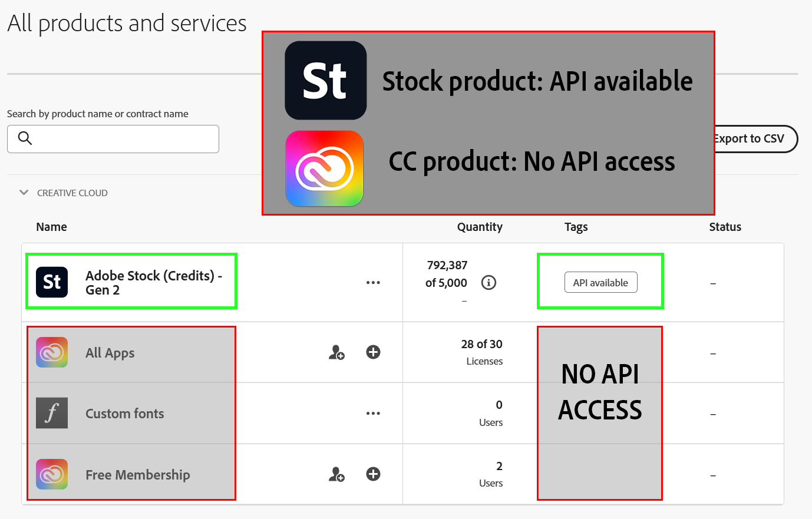

---
keywords:
  - Adobe Stock
  - Stock API
  - Stock Photos
  - Stock Video
  - Premium Images
  - Illustrations
  - Creative Cloud
title: Stock APIs
description: Getting started with the Adobe Stock API. Build an API application to access millions of royalty-free stock images, photos, graphics, vectors, video footage, illustrations, templates, 3d assets, editorial assets and high-quality premium content.
---

<!-- 
import GettingStarted from './getting-started/index.md'
<GettingStarted />
-->

# Please read me first!

Beginning in November, 2024, the Stock API will only be available to Stock for Enterprise customers. If you don't know if you have Stock for Enterprise, see [Do I have Stock for Enterprise?](#do-i-have-stock-for-enterprise) To create an integration, you must either be a System Administrator or a [member of the Developers group](https://helpx.adobe.com/enterprise/using/manage-developers.html) for the Stock product. *Hint: If you do not see an option to add Developers or API credentials, then you **do not** have Stock for Enterprise.* If you want to get a quote for Stock for Enterprise, please contact your Adobe account representative or [request a callback](https://www.adobe.com/creativecloud/business/enterprise.html#creativecloud-rfi). 

If you are a Stock for Enterprise customer, then you can create a [Server to Server integration](https://developer.adobe.com/developer-console/docs/guides/authentication/ServerToServerAuthentication/), which does not require a login. Go to [Getting Started](./getting-started/index.md) to begin.

If you do not have Stock for Enterprise, then you will not be able to create an integration at this time without being accepted into a program unless you have a compelling business reason or have an Adobe business sponsor. Adobe affiliates who are approved to join the Adobe campaign may be pre-approved.

The approval process is still being rolled out. You may email [the Stock API team](stockapis@adobe.com) with questions.
<!--
To request approval: Go to https://www.adobeprerelease.com and join the "Adobe Stock API" program. As noted, if you have been approved to join the Adobe Affiliate program, then you should be approved to use the Stock API. 
-->

## Do I have Stock for Enterprise?

1. First, do you have access to the [Adobe Admin Console](https://adminconsole.adobe.com/)?
2. Second, when you click on Products, do you see an Adobe Stock product or a Creative Cloud (CC) product? In the screenshot below, this customer has an Adobe Stock Credits product, as well as a CC All Apps product. They can use the Stock API, but only with their Stock credits product. They cannot create an integration for CC All Apps because it is not a Stock product.

For more information on why Creative Cloud does not have API access, see the FAQ [May I use my Creative Cloud Professional or Professional Plus plan with the Stock API?](https://developer.adobe.com/stock/docs/faq/stock-api-business-faq/#may-i-use-my-creative-cloud-professional-or-professional-plus-plan-with-the-stock-api).

## Adobe Affiliates

Join the Adobe Affiliate Program and earn attractive commissions. Promote Adobe Creative Cloud, Adobe Stock and Adobe Document Cloud on your website, blog or social media channel. It's free, it's easy, and it pays.

While most Adobe Affiliates display banner advertising on their websites, affiliate partners can choose to integrate with the Stock Search API to create a custom search experience for their users. 

  *  To join the Adobe Affiliate Program, go here: [https://www.adobe.com/affiliates.html](https://www.adobe.com/affiliates.html).
  *  For an in-depth use case, see [Get Paid to Search Adobe Stock!](https://medium.com/adobetech/get-paid-to-search-adobe-stock-e2ba9a7c0312)

See the [Affiliates FAQ](faq/stock-api-business-faq.md#affiliates-faq) for more information.

Note that you will still need to join the [Stock API Prerelease program](https://www.adobeprerelease.com) as well as join the Adobe Affiliate program.

## Next steps

Once you have been accepted into the program or to access Stock API documentation, go to [Getting Started](./getting-started/01-getting-started.md).
